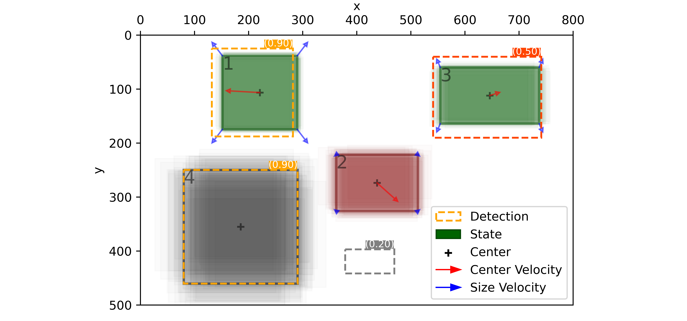
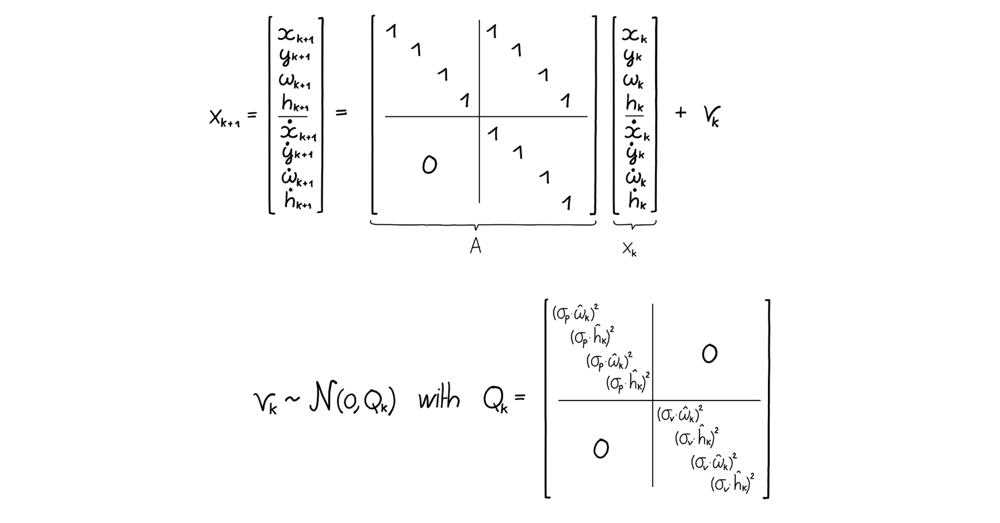
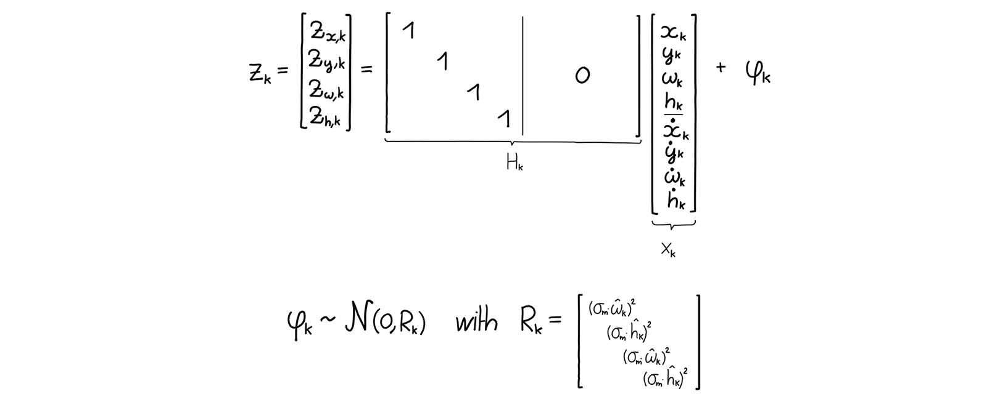
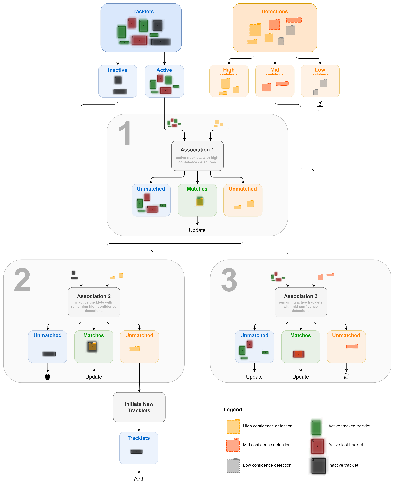

# Object Tracking
Object tracking method using a Kalman Filter and a matching process inspired by [ByteTrack](https://arxiv.org/pdf/2110.06864.pdf).



## Installation

The tracking package can be installed using pip by running the following commands:

```bash
cd object-tracking
pip install -e .
```

## Usage
### Interactive tracking example

Run the following lines with Python:

```python
from tracking import InteractiveTracker
InteractiveTracker()
```

Or alternatively, run:
```bash
python -m tracking.interactive_tracker
```

### Example usage

Run the following lines with Python:

```python
from tracking import Tracker, Detection

# Initialize the tracker
config = {}
tracker = Tracker(config)

# Get some detections
detections = [Detection(500, 100, 100, 100, "object", 0.9),
              Detection(200, 300, 200, 100, "object", 0.8)]

# Update the tracker
tracker.update(detections)

# Visualize the tracker state
tracker.show(savefig="tracker_1.png")

# Get some other detections
detections = [Detection(480, 120, 140, 120, "object", 0.95),
              Detection(200, 300, 170, 80, "object", 0.9)]

# Update the tracker again
tracker.update(detections)

# Visualize the new tracker state
tracker.show(savefig="tracker_2.png")
```

# Method

## Kalman Filter

### State

The state is represented by a $\mathbb{R}^8$ vector $\mathbf x$. The state captures the position $(x, y)$ and size $(w, h)$  of the bounding box as well as their time deriatives $(\dot x, \dot y)$ and $(\dot w, \dot h)$:

$$
\mathbf{x} = (x, y, w, h, \dot x, \dot y, \dot w, \dot h)^\top
$$

### Dynamics

The dynamics are described by the following constant velocity model with independent gaussian noise:



where $\hat \bullet$ stands for the current mean estimate of the state.

### Measurement Model

The measurements are the detections, which can be obtained via an object detector such as [YOLO](https://arxiv.org/pdf/1506.02640.pdf). The measurement model is given by:

$$
\mathbf{z} = (z_x, z_y, z_w, z_h)^\top
$$



### Adaptive Measurement Noise

Inspired by the NSA Kalman Filter proposed in [GIAOTracker](https://arxiv.org/pdf/2202.11983.pdf), the measurement noise should vary with the detection confidence. The following adaptive formulation is used to adapt the noise measurement:


## Matching

Inspired by [ByteTrack](https://arxiv.org/pdf/2110.06864.pdf), the following three-stage matching process is employed:


